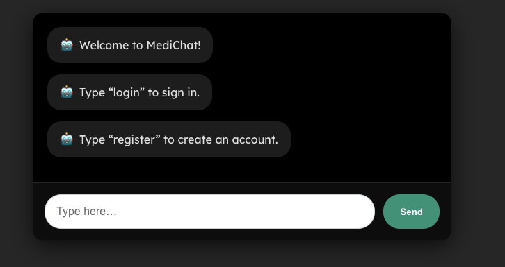

# MediChat – AI-Powered Registration & Chat System

MediChat is a full-stack web application that uses a chatbot interface to allow **patients** and **healthcare providers** to register, log in, and chat with an AI assistant. It supports secure authentication, role-based data capture, and sends confirmation emails using **Azure Communication Services**. 

---

## Features

- **Chatbot-driven login and registration**  
  No traditional forms — the chatbot guides users through each step. 

- **Secure Authentication**  
  Passwords hashed with bcrypt and SHA256; JWT for session management. 

- **Email Notifications**  
  Users receive confirmation on registration and login via Azure Email. 

- **AI Chat Integration**  
  Logged-in users can interact with **Google Gemini AI** (Generative AI) for responses. 

---

