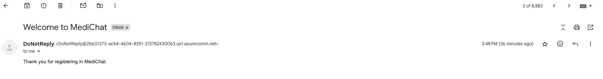
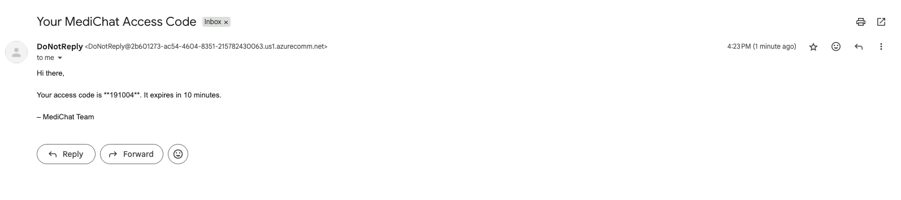
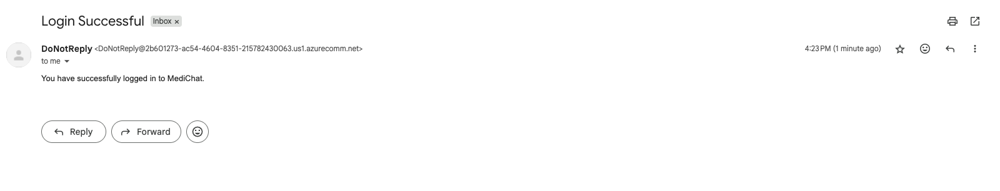
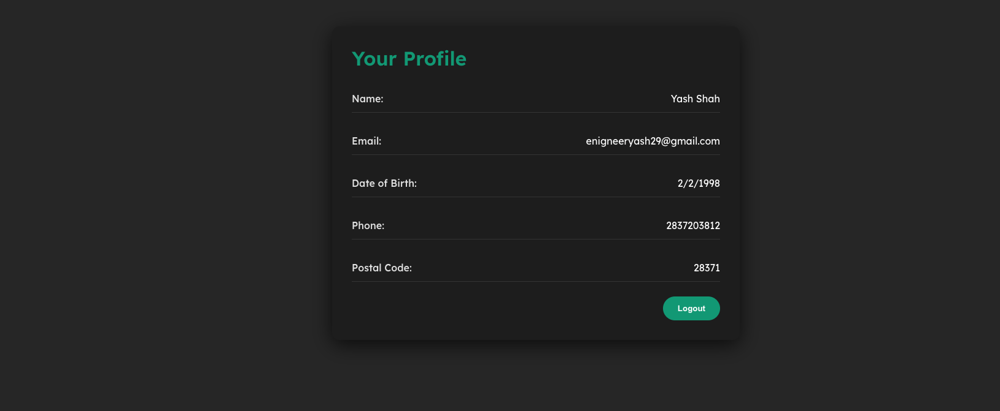

# MediChat – Agentic AI-Powered Registration & Login System

MediChat is a full-stack web application that uses a chatbot interface to allow **patients** and **healthcare providers** to register, log in, and chat with an AI assistant. It supports secure authentication, role-based data capture, and sends confirmation emails using **Azure Communication Services**. 

---

## Features

- **Chatbot-driven login and registration**  
  No traditional forms — the chatbot guides users through each step. 

- **Secure Authentication**  
  Passwords hashed with bcrypt and SHA256; JWT for session management. 

- **Email Notifications**  
  Users receive confirmation on registration and login via Azure Email. 

- **AI Chat Integration**  
  Logged-in users can interact with **Google Gemini AI** (Generative AI) for responses. 

- **Profile Page**
  After successful login, users are automatically redirected to a protected profile page (/medichat/profile) where their personal details (for patients) or institution details (for providers) are displayed, with an option to log out.

---

## Profile Page

The Profile Page is built as a protected route in React Router. It fetches user data from the backend endpoint /api/me using the stored JWT. Depending on the user's role (patient or provider), it renders:  
Patients: Name, Email, Date of Birth, Phone, Postal Code.  
Providers: Name, Email, Institution Name, Institution Email, Institution Phone, Address.  
A "Logout" button clears the token and redirects the user back to the chatbot login screen.  

## Getting Started

1. **Clone the repo**

git clone https://github.com/yourusername/medichat.git  

2. **Create environment file**

cp .env.example .env  
# Then edit .env with your credentials:
# MONGO_URI, JWT_SECRET,
# AZURE_COMM_EMAIL_CONNECTION_STRING,
# SENDER_EMAIL_ADDRESS,
# GEMINI_API_KEY,

3. **Run with Docker Compose**

Option A (build locally): docker compose up --build -d  
Option B (use pre-built images):  
- docker compose pull  
- docker compose up -d  

4. **Verify services**

Backend: http://localhost:5001  
Frontend: http://localhost:3000/medichat  

5. **Stop all services**

docker compose down

  

## Working of My Agentic AI Chat System

  

 

 

 

